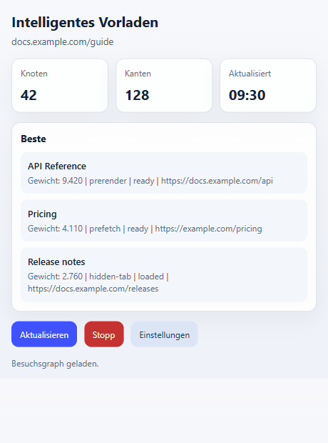
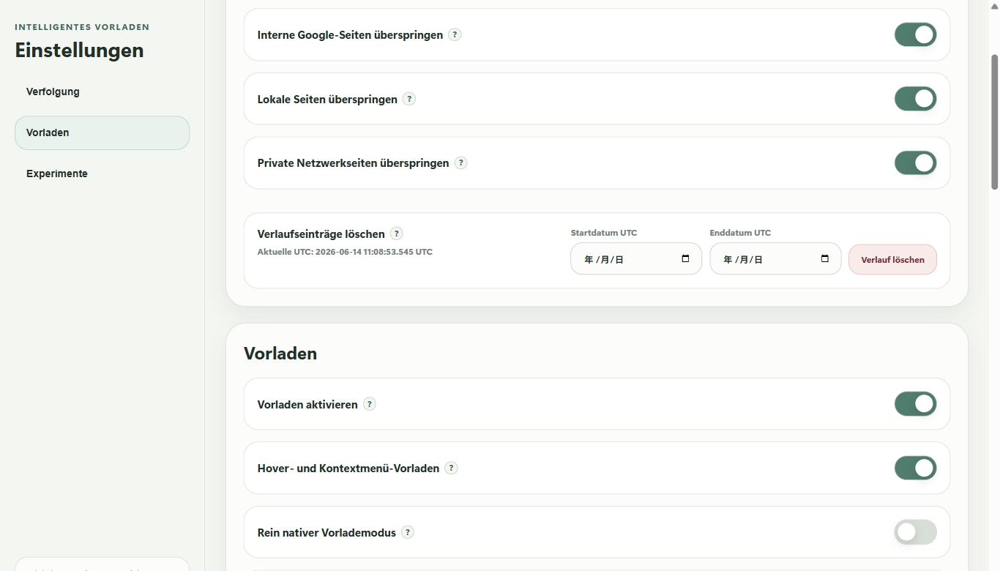

  

# Smart Preload / Zero Latency Web

[English](README.md) | [简体中文](README.zh-CN.md) | [繁體中文](README.zh-TW.md) | [日本語](README.ja.md) | [한국어](README.ko.md) | Deutsch | [Français](README.fr.md) | [Español](README.es.md) | [Português (Brasil)](README.pt-BR.md) | [Русский](README.ru.md)

Smart Preload bereitet Seiten vor, die Sie wahrscheinlich als Naechstes oeffnen. Recherche, Vergleiche, Dokumentation und Arbeit mit vielen Tabs fuehlen sich dadurch weniger unterbrochen an.

Es hilft besonders, wenn Sie Suchergebnisse durchgehen, Seiten vergleichen oder oft zwischen verwandten Websites wechseln.

## Was Die Rangliste Bedeutet

Die Rangliste im Popup gilt fuer den aktuellen Tab. Sie ist keine globale Beliebtheitsliste.

- `Top` zeigt die wahrscheinlichsten Kandidaten fuer diesen Tab.
- `Weight` ist die aktuelle Prioritaet.
- `Freq` zeigt gelernte Wechselhaeufigkeit von dieser Seite oder Website.
- `prerender`, `prefetch` und `hidden-tab` zeigen, wie die Seite vorbereitet wird.
- Der Status zeigt, ob ein Kandidat bereit, geladen oder noch wartend ist.

Damit sehen Sie, was die Erweiterung gerade vorbereitet, und koennen pruefen, warum ein Link ausgewaehlt wurde oder nicht.

## Wann Sie Pausieren Sollten

Pausieren Sie Smart Preload vor Online-Pruefungen, beaufsichtigten Tests, gesperrten Firmenbrowsern, Banking-Ablauf und anderen sicherheitskritischen Seiten. Solche Umgebungen koennen Erweiterungen, Hintergrund-Tabs oder vorab geladene Seiten ablehnen.

Nutzen Sie im Popup `Stop` fuer eine schnelle Pause. Alternativ koennen Sie in den Einstellungen `Enable preloading` deaktivieren. Wenn ein Test- oder Sicherheitstool auch Hintergrund-Apps prueft, beenden Sie vorher die Windows-Begleitapp im Tray.

## Verlaufsdaten Und Migration

Der gelernte Verlauf liegt im Speicher der Browsererweiterung, nicht im Ordner der Windows-App.

Typische Pfade:

- Chrome: `%LOCALAPPDATA%\Google\Chrome\User Data\<Profile>\Local Extension Settings\<extension-id>\`
- Edge: `%LOCALAPPDATA%\Microsoft\Edge\User Data\<Profile>\Local Extension Settings\<extension-id>\`

`<Profile>` ist oft `Default` oder `Profile 1`. Die Erweiterungs-ID finden Sie unter `chrome://extensions` oder `edge://extensions` in den Details.

Migration auf einen neuen Computer oder ein neues Profil:

1. Installieren oder laden Sie die Erweiterung einmal im Zielbrowser.
2. Schliessen Sie den Zielbrowser vollstaendig.
3. Kopieren Sie den Inhalt des alten `<extension-id>` Ordners in den passenden Erweiterungsspeicher des Zielbrowsers.
4. Wenn sich die Erweiterungs-ID geaendert hat, kopieren Sie den Inhalt in den neuen ID-Ordner.
5. Starten Sie den Browser neu.

Der `portable` Ordner der Windows-App enthaelt Bindungsdateien und Logs, nicht den Browserverlauf. In den Einstellungen koennen gelernte Eintraege nach UTC-Datumsbereich geloescht werden.

## Installation

Laden Sie die neueste Version ueber [GitHub Releases](https://github.com/kingstonwang114514-cloud/zero-latency-web/releases/latest) herunter.

1. Installieren oder laden Sie die Erweiterung in Chrome oder Edge.
2. Optional: entpacken Sie die Windows-Begleitapp.
3. Fuehren Sie `install-register.cmd` im app-Ordner aus oder starten Sie die App einmal.
4. Lassen Sie den app-Ordner an seinem endgueltigen Ort.

Die Erweiterung kann ohne Windows-App laufen. Die App ist nur fuer Windows und dient staerkerer lokaler Browserintegration.

## Browser-Unterstuetzung

- Google Chrome
- Microsoft Edge
- Andere Chromium-basierte Browser koennen funktionieren, Ziel sind aber Chrome und Edge.
