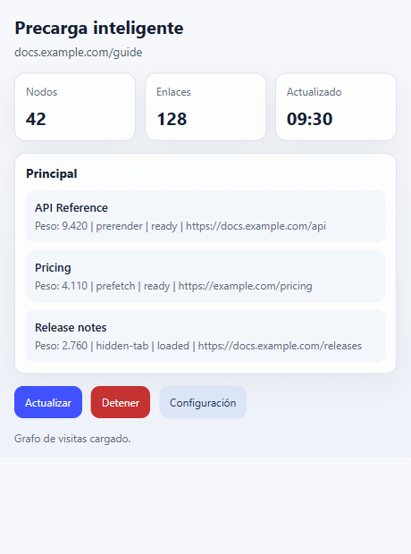
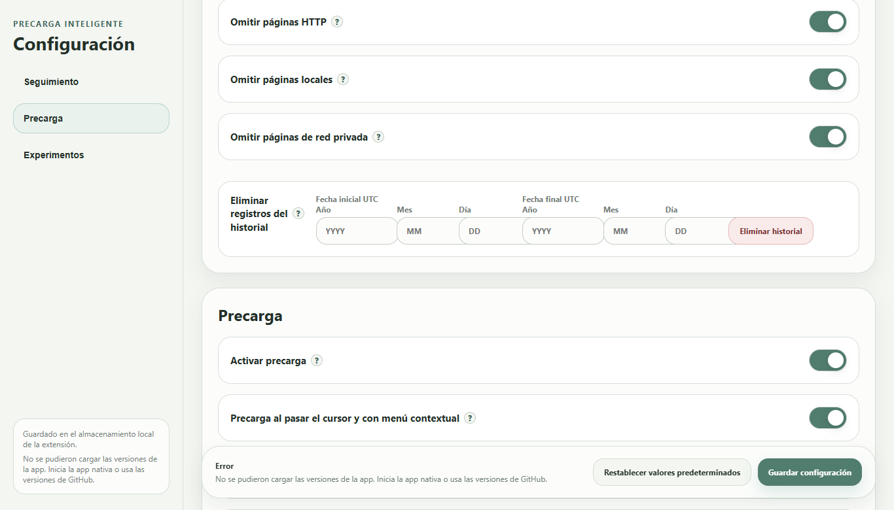
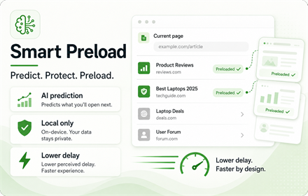
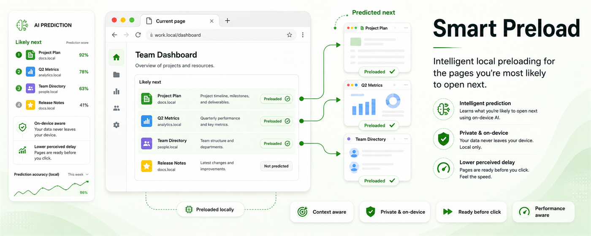
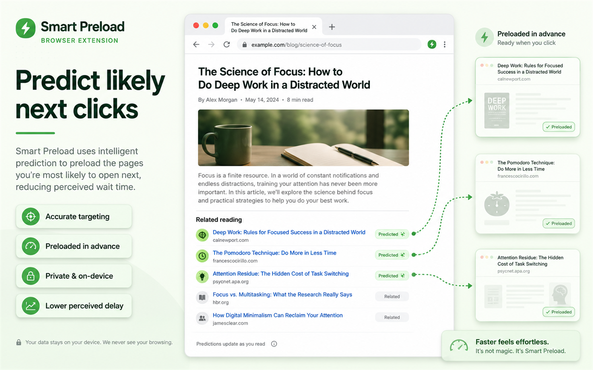

  

# Smart Preload / Zero Latency Web

[English](README.md) | [简体中文](README.zh-CN.md) | [繁體中文](README.zh-TW.md) | [日本語](README.ja.md) | [한국어](README.ko.md) | [Deutsch](README.de.md) | [Français](README.fr.md) | Español | [Português (Brasil)](README.pt-BR.md) | [Русский](README.ru.md)

Smart Preload utiliza algoritmos inteligentes de precarga para reducir los tiempos de espera percibidos durante la carga y mejorar la experiencia de navegación.

Es mas util cuando revisas resultados de busqueda, comparas paginas o saltas con frecuencia entre sitios relacionados.

## Para Que Sirve El Ranking

El ranking del popup corresponde a la pestana actual. No es una lista global de popularidad.

- `Top` muestra las paginas que Smart Preload probablemente preparara para esta pestana.
- `Weight` es la prioridad actual.
- `Freq` muestra la frecuencia aprendida de navegacion desde esta pagina o sitio.
- `prerender`, `prefetch` y `hidden-tab` muestran como se prepara la pagina.
- El estado indica si el candidato esta listo, cargado o en espera.

Usa esta lista para entender que esta preparando la extension y comprobar por que un enlace fue elegido o no.

## Cuando Pausarlo

Pausa Smart Preload antes de examenes en linea, sesiones supervisadas, navegadores corporativos bloqueados, banca en linea u otras paginas con controles fuertes. Estos entornos pueden rechazar extensiones, pestanas en segundo plano o paginas precargadas.

Usa el boton `Stop` del popup para una pausa rapida. Tambien puedes desactivar `Enable preloading` en Configuracion. Si una herramienta de examen o seguridad tambien revisa apps en segundo plano, sal de la app de Windows desde la bandeja antes de empezar.

## Datos Historicos Y Migracion

El historial aprendido se guarda en el almacenamiento de la extension del navegador, no en la carpeta de la app de Windows.

Rutas habituales:

- Chrome: `%LOCALAPPDATA%\Google\Chrome\User Data\<Profile>\Local Extension Settings\<extension-id>\`
- Edge: `%LOCALAPPDATA%\Microsoft\Edge\User Data\<Profile>\Local Extension Settings\<extension-id>\`

`<Profile>` suele ser `Default` o `Profile 1`. El ID de la extension se ve en los detalles de `chrome://extensions` o `edge://extensions`.

Para migrar a otro equipo o perfil:

1. Instala o carga la extension una vez en el navegador de destino.
2. Cierra completamente ese navegador.
3. Copia el contenido de la antigua carpeta `<extension-id>` en la carpeta de almacenamiento correspondiente del navegador de destino.
4. Si el ID de la extension cambio, copia el contenido dentro de la carpeta del nuevo ID.
5. Inicia el navegador de nuevo.

La carpeta `portable` de la app de Windows guarda archivos de vinculacion y logs, no el historial de navegacion. En Configuracion puedes borrar registros aprendidos por rango de fechas UTC.

## Instalacion

Descarga la version mas reciente desde [GitHub Releases](https://github.com/BIOcanse/Smart-Preload/releases/latest).

1. Instala o carga la extension en Chrome o Edge.
2. Opcional: extrae la app complementaria de Windows.
3. Ejecuta `install-register.cmd` desde la carpeta app, o inicia la app una vez.
4. Mantén la carpeta app en su ubicacion final.

La extension puede funcionar sin la app de Windows. La app es solo para Windows y sirve para una integracion local mas fuerte con el navegador.

## Navegadores Compatibles

- Google Chrome
- Microsoft Edge
- Otros navegadores basados en Chromium pueden funcionar, pero Chrome y Edge son los objetivos previstos.

## Licencia

Smart Preload / Zero Latency Web esta licenciado bajo la [Apache License 2.0](LICENSE). Consulta [NOTICE](NOTICE) para los avisos de atribucion.

## Imagenes Promocionales de Chrome Web Store

