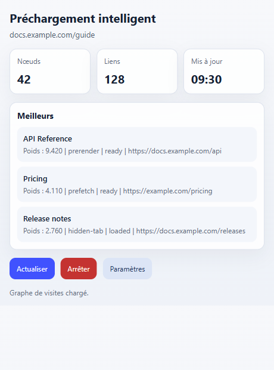
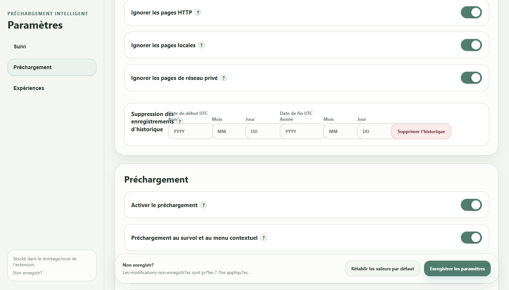

  

# Smart Preload / Zero Latency Web

[English](README.md) | [简体中文](README.zh-CN.md) | [繁體中文](README.zh-TW.md) | [日本語](README.ja.md) | [한국어](README.ko.md) | [Deutsch](README.de.md) | Français | [Español](README.es.md) | [Português (Brasil)](README.pt-BR.md) | [Русский](README.ru.md)

Smart Preload utilise des algorithmes de préchargement intelligents pour réduire le temps d'attente ressenti au chargement et améliorer l'expérience de navigation.

Il est surtout utile lorsque vous parcourez des resultats de recherche, comparez des pages ou passez souvent entre des sites lies.

## A Quoi Sert Le Classement

Le classement du popup concerne l'onglet courant. Ce n'est pas une liste globale de popularite.

- `Top` montre les pages que Smart Preload est le plus susceptible de preparer pour cet onglet.
- `Weight` est la priorite actuelle.
- `Freq` indique la frequence de navigation apprise depuis cette page ou ce site.
- `prerender`, `prefetch` et `hidden-tab` indiquent la methode de preparation.
- Le statut indique si le candidat est pret, charge ou encore en attente.

Utilisez cette liste pour comprendre ce que l'extension prepare et verifier pourquoi un lien a ete choisi ou non.

## Quand Le Mettre En Pause

Mettez Smart Preload en pause avant les examens en ligne, les sessions surveillees, les navigateurs d'entreprise verrouilles, les operations bancaires ou les pages a controle de securite fort. Ces environnements peuvent refuser les extensions, les onglets en arriere-plan ou les pages prechargees.

Utilisez le bouton `Stop` du popup pour une pause rapide. Vous pouvez aussi desactiver `Enable preloading` dans les parametres. Si un outil d'examen ou de securite verifie aussi les applications en arriere-plan, quittez l'application Windows depuis la zone de notification avant de commencer.

## Donnees D'Historique Et Migration

L'historique appris est stocke dans le stockage de l'extension du navigateur, pas dans le dossier de l'application Windows.

Chemins habituels :

- Chrome : `%LOCALAPPDATA%\Google\Chrome\User Data\<Profile>\Local Extension Settings\<extension-id>\`
- Edge : `%LOCALAPPDATA%\Microsoft\Edge\User Data\<Profile>\Local Extension Settings\<extension-id>\`

`<Profile>` est souvent `Default` ou `Profile 1`. L'ID de l'extension est visible dans les details de `chrome://extensions` ou `edge://extensions`.

Pour migrer vers un autre ordinateur ou profil :

1. Installez ou chargez l'extension une fois dans le navigateur cible.
2. Fermez completement ce navigateur.
3. Copiez le contenu de l'ancien dossier `<extension-id>` dans le dossier de stockage correspondant du navigateur cible.
4. Si l'ID de l'extension a change, copiez le contenu dans le dossier du nouvel ID.
5. Redemarrez le navigateur.

Le dossier `portable` de l'application Windows contient les fichiers de liaison et les logs, pas l'historique de navigation. Dans les parametres, vous pouvez supprimer les donnees apprises par plage de dates UTC.

## Installation

Telechargez la derniere version depuis [GitHub Releases](https://github.com/BIOcanse/Smart-Preload/releases/latest).

1. Installez ou chargez l'extension dans Chrome ou Edge.
2. Facultatif : extrayez l'application Windows.
3. Executez `install-register.cmd` dans le dossier app, ou lancez l'application une fois.
4. Gardez le dossier app a son emplacement final.

L'extension peut fonctionner sans l'application Windows. L'application est uniquement pour Windows et sert a une integration locale plus forte avec le navigateur.

## Navigateurs Pris En Charge

- Google Chrome
- Microsoft Edge
- D'autres navigateurs bases sur Chromium peuvent fonctionner, mais Chrome et Edge sont les cibles prevues.

## Licence

Smart Preload / Zero Latency Web est sous [Apache License 2.0](LICENSE). Consultez [NOTICE](NOTICE) pour les avis d'attribution.

## Images Promotionnelles du Chrome Web Store

