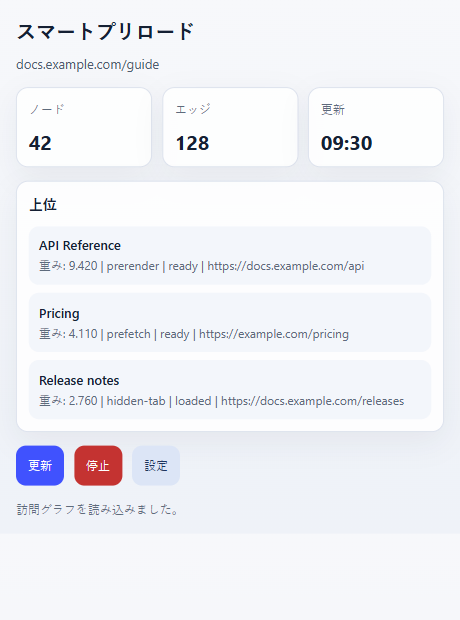
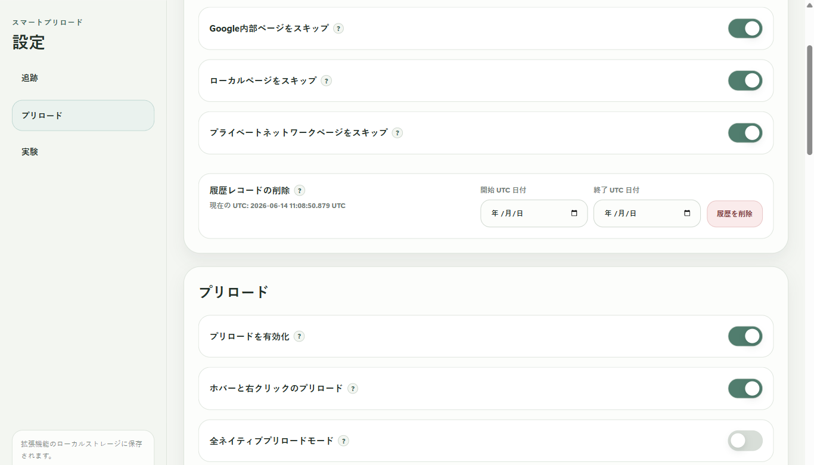

  

# Smart Preload / Zero Latency Web

[English](README.md) | [简体中文](README.zh-CN.md) | [繁體中文](README.zh-TW.md) | 日本語 | [한국어](README.ko.md) | [Deutsch](README.de.md) | [Français](README.fr.md) | [Español](README.es.md) | [Português (Brasil)](README.pt-BR.md) | [Русский](README.ru.md)

Smart Preload は、次に開く可能性が高いページを先に準備し、調査、比較、ドキュメント閲覧、複数タブ作業の待ち時間を減らします。

検索結果を順に開く、商品や資料を比較する、関連ページを何度も行き来する、といった使い方に向いています。

## ランキングの意味

ポップアップのランキングは現在のタブ向けです。全体の人気ページではありません。

- `Top` は現在のタブで準備されやすい候補ページです。
- `Weight` は現在の優先度です。
- `Freq` はこのページまたはサイトから移動した履歴頻度です。
- `prerender`、`prefetch`、`hidden-tab` は準備方法です。
- 状態は候補が準備済み、読み込み済み、待機中のどれかを示します。

この一覧を見ると、拡張機能が今どのページを準備しているか、また特定のリンクが選ばれなかった理由を確認しやすくなります。

## 一時停止した方がよい場面

オンライン試験、監督付きテスト、管理された社内ブラウザ、ネットバンキング、強い不正対策があるページでは、事前に Smart Preload を停止することをおすすめします。これらの環境では拡張機能、バックグラウンドタブ、事前読み込みが問題になる場合があります。

一時停止はポップアップの `Stop` を使います。設定の `Enable preloading` をオフにすることもできます。テストやセキュリティツールがバックグラウンドアプリも確認する場合は、開始前に Windows 連携アプリをトレイから終了してください。

## 履歴データと移行

学習履歴はブラウザの拡張機能ストレージに保存されます。Windows アプリのフォルダーではありません。

一般的な場所:

- Chrome: `%LOCALAPPDATA%\Google\Chrome\User Data\<Profile>\Local Extension Settings\<extension-id>\`
- Edge: `%LOCALAPPDATA%\Microsoft\Edge\User Data\<Profile>\Local Extension Settings\<extension-id>\`

`<Profile>` は `Default` や `Profile 1` であることが多いです。拡張機能 ID は `chrome://extensions` または `edge://extensions` の詳細で確認できます。

移行手順:

1. 移行先ブラウザで拡張機能を一度インストールまたは読み込みます。
2. 移行先ブラウザを完全に終了します。
3. 古い `<extension-id>` フォルダーの中身を、移行先の対応する拡張機能ストレージにコピーします。
4. 拡張機能 ID が変わった場合は、新しい ID のフォルダーへ中身をコピーします。
5. ブラウザを再起動します。

Windows アプリの `portable` フォルダーには連携ファイルとログが入ります。閲覧履歴の保存場所ではありません。設定では UTC 日付範囲を指定して学習記録を削除できます。

## インストール

最新版は [GitHub Releases](https://github.com/kingstonwang114514-cloud/zero-latency-web/releases/latest) からダウンロードしてください。

1. Chrome または Edge に拡張機能をインストールまたは読み込みます。
2. 任意で Windows 連携アプリを展開します。
3. app フォルダーの `install-register.cmd` を実行するか、アプリを一度起動します。
4. app フォルダーは最終的な場所に置いてください。

拡張機能は Windows アプリなしでも動作します。Windows アプリは Windows 専用で、より強いローカル連携が必要な場合に使います。

## 対応ブラウザ

- Google Chrome
- Microsoft Edge
- その他の Chromium ベースブラウザでも動作する可能性がありますが、主な対象は Chrome と Edge です。
