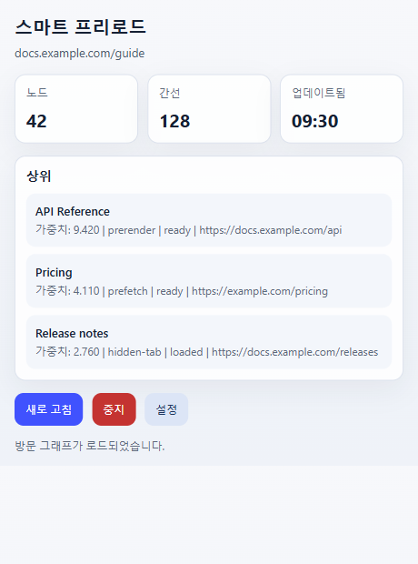
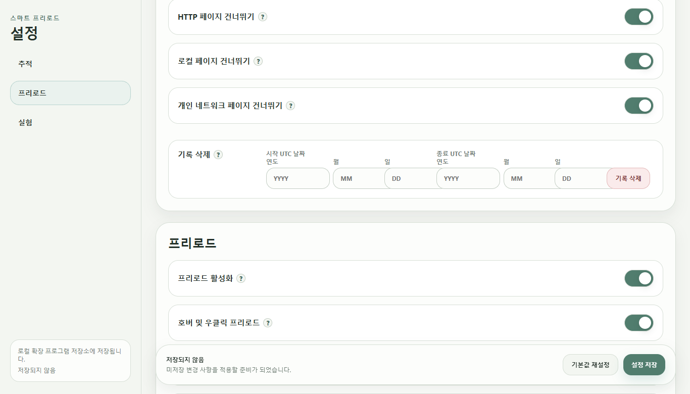

  

# Smart Preload / Zero Latency Web

[English](README.md) | [简体中文](README.zh-CN.md) | [繁體中文](README.zh-TW.md) | [日本語](README.ja.md) | 한국어 | [Deutsch](README.de.md) | [Français](README.fr.md) | [Español](README.es.md) | [Português (Brasil)](README.pt-BR.md) | [Русский](README.ru.md)

Smart Preload는 지능형 프리로드 알고리즘을 사용해 체감 로딩 대기 시간을 줄이고 브라우징 경험을 개선합니다.

검색 결과를 계속 열어 보거나, 상품과 자료를 비교하거나, 관련 페이지 사이를 자주 오가는 상황에 적합합니다.

## 순위의 의미

팝업의 순위는 현재 탭 기준입니다. 전체 인기 페이지 목록이 아닙니다.

- `Top`은 현재 탭에서 준비될 가능성이 높은 후보 페이지입니다.
- `Weight`는 현재 우선순위입니다.
- `Freq`는 이 페이지나 사이트에서 이동했던 학습 빈도입니다.
- `prerender`, `prefetch`, `hidden-tab`은 페이지 준비 방식입니다.
- 상태는 후보가 준비됨, 로드됨, 대기 중인지 보여 줍니다.

이 목록은 확장 프로그램이 지금 무엇을 준비하는지 확인하고, 특정 링크가 왜 선택되지 않았는지 점검하는 데 유용합니다.

## 잠시 꺼야 하는 경우

온라인 시험, 감독 시험, 회사의 제한된 브라우저, 인터넷 뱅킹, 보안 검사가 강한 페이지에서는 먼저 Smart Preload를 멈추는 것이 좋습니다. 이런 환경은 확장 프로그램, 백그라운드 탭, 미리 로드된 페이지를 허용하지 않을 수 있습니다.

빠르게 멈추려면 팝업의 `Stop`을 누르세요. 설정에서 `Enable preloading`을 끌 수도 있습니다. 시험 또는 보안 도구가 백그라운드 앱까지 확인한다면 시작 전에 Windows 보조 앱도 트레이에서 종료하세요.

## 기록 데이터와 이전

학습 기록은 브라우저 확장 프로그램 저장소에 저장됩니다. Windows 앱 폴더에 저장되지 않습니다.

일반적인 위치:

- Chrome: `%LOCALAPPDATA%\Google\Chrome\User Data\<Profile>\Local Extension Settings\<extension-id>\`
- Edge: `%LOCALAPPDATA%\Microsoft\Edge\User Data\<Profile>\Local Extension Settings\<extension-id>\`

`<Profile>`은 보통 `Default` 또는 `Profile 1`입니다. 확장 프로그램 ID는 `chrome://extensions` 또는 `edge://extensions`의 세부 정보에서 확인할 수 있습니다.

새 컴퓨터나 새 프로필로 옮기는 방법:

1. 대상 브라우저에서 확장 프로그램을 한 번 설치하거나 로드합니다.
2. 대상 브라우저를 완전히 종료합니다.
3. 이전 `<extension-id>` 폴더의 내용을 대상 브라우저의 해당 확장 저장소 폴더로 복사합니다.
4. 확장 프로그램 ID가 바뀌었다면 새 ID 폴더 안으로 내용을 복사합니다.
5. 브라우저를 다시 시작합니다.

Windows 앱의 `portable` 폴더에는 앱 연결 파일과 로그가 저장됩니다. 방문 기록 저장소가 아닙니다. 설정에서는 UTC 날짜 범위로 학습 기록을 삭제할 수 있습니다.

## 설치

최신 버전은 [GitHub Releases](https://github.com/BIOcanse/Smart-Preload/releases/latest)에서 다운로드하세요.

1. Chrome 또는 Edge에 확장 프로그램을 설치하거나 로드합니다.
2. 선택 사항으로 Windows 보조 앱을 압축 해제합니다.
3. app 폴더에서 `install-register.cmd`를 실행하거나 앱을 한 번 시작합니다.
4. app 폴더는 최종 위치에 두세요.

확장 프로그램은 Windows 앱 없이도 동작합니다. Windows 앱은 Windows 전용이며 더 강한 로컬 브라우저 연동이 필요할 때 사용합니다.

## 브라우저 지원

- Google Chrome
- Microsoft Edge
- 기타 Chromium 기반 브라우저에서도 동작할 수 있지만, 주요 대상은 Chrome과 Edge입니다.

## 라이선스

Smart Preload / Zero Latency Web은 [Apache License 2.0](LICENSE)에 따라 라이선스됩니다. 저작권 고지는 [NOTICE](NOTICE)를 참고하세요.
