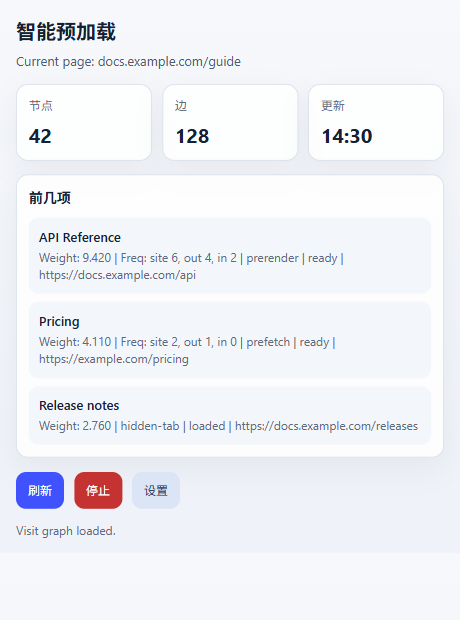
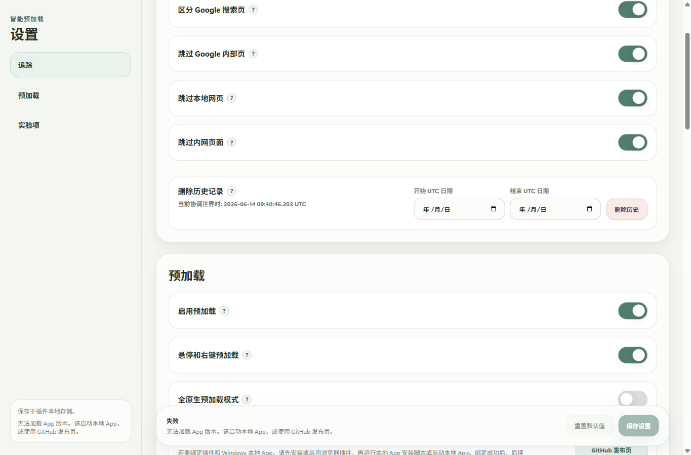

  

# Smart Preload / Zero Latency Web

[English](README.md) | [简体中文](README.zh-CN.md) | [繁體中文](README.zh-TW.md) | [日本語](README.ja.md) | [한국어](README.ko.md) | [Deutsch](README.de.md) | [Français](README.fr.md) | [Español](README.es.md) | Português (Brasil) | [Русский](README.ru.md)

Smart Preload prepara as paginas que voce provavelmente abrira em seguida, deixando pesquisa, comparacao, leitura de documentacao e trabalho com muitas abas com menos interrupcoes.

Ele e mais util quando voce percorre resultados de busca, compara paginas ou alterna com frequencia entre sites relacionados.

## Para Que Serve O Ranking

O ranking do popup vale para a aba atual. Ele nao e uma lista global de popularidade.

- `Top` mostra as paginas que o Smart Preload provavelmente preparara para esta aba.
- `Weight` e a prioridade atual.
- `Freq` mostra a frequencia aprendida de navegacao a partir desta pagina ou site.
- `prerender`, `prefetch` e `hidden-tab` mostram como a pagina esta sendo preparada.
- O status mostra se o candidato esta pronto, carregado ou aguardando.

Use esta lista para entender o que a extensao esta preparando e verificar por que um link foi escolhido ou nao.

## Quando Pausar

Pause o Smart Preload antes de provas online, sessoes monitoradas, navegadores corporativos bloqueados, internet banking ou paginas com verificacoes fortes. Esses ambientes podem rejeitar extensoes, abas em segundo plano ou paginas pre-carregadas.

Use o botao `Stop` no popup para uma pausa rapida. Voce tambem pode desativar `Enable preloading` nas Configuracoes. Se uma ferramenta de prova ou seguranca tambem verificar apps em segundo plano, saia do app do Windows pela bandeja antes de comecar.

## Dados Historicos E Migracao

O historico aprendido fica no armazenamento da extensao do navegador, nao na pasta do app do Windows.

Caminhos comuns:

- Chrome: `%LOCALAPPDATA%\Google\Chrome\User Data\<Profile>\Local Extension Settings\<extension-id>\`
- Edge: `%LOCALAPPDATA%\Microsoft\Edge\User Data\<Profile>\Local Extension Settings\<extension-id>\`

`<Profile>` geralmente e `Default` ou `Profile 1`. O ID da extensao aparece nos detalhes de `chrome://extensions` ou `edge://extensions`.

Para migrar para outro computador ou perfil:

1. Instale ou carregue a extensao uma vez no navegador de destino.
2. Feche completamente esse navegador.
3. Copie o conteudo da antiga pasta `<extension-id>` para a pasta de armazenamento correspondente no navegador de destino.
4. Se o ID da extensao mudou, copie o conteudo para a pasta do novo ID.
5. Abra o navegador novamente.

A pasta `portable` do app do Windows guarda arquivos de vinculacao e logs, nao o historico de navegacao. Nas Configuracoes, voce pode apagar registros aprendidos por intervalo de datas UTC.

## Instalacao

Baixe a versao mais recente em [GitHub Releases](https://github.com/kingstonwang114514-cloud/zero-latency-web/releases/latest).

1. Instale ou carregue a extensao no Chrome ou Edge.
2. Opcional: extraia o app complementar do Windows.
3. Execute `install-register.cmd` na pasta app, ou inicie o app uma vez.
4. Mantenha a pasta app no local final.

A extensao pode funcionar sem o app do Windows. O app e exclusivo para Windows e serve para uma integracao local mais forte com o navegador.

## Navegadores Compativeis

- Google Chrome
- Microsoft Edge
- Outros navegadores baseados em Chromium podem funcionar, mas Chrome e Edge sao os alvos previstos.
