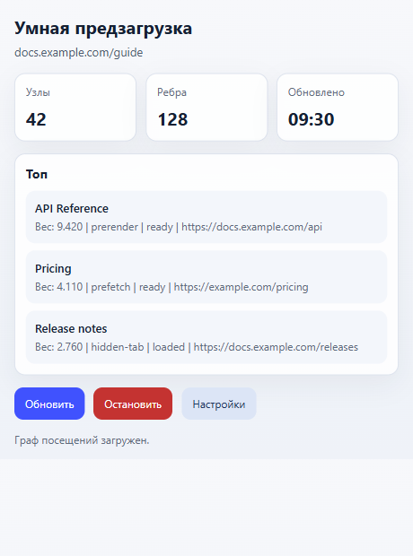
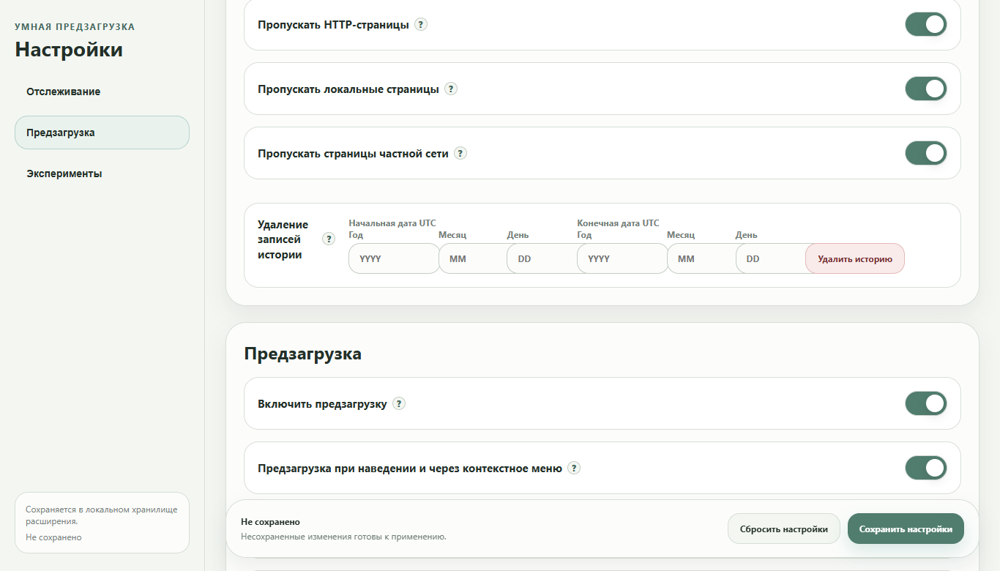
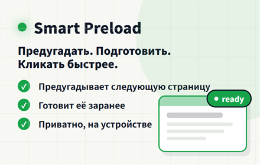
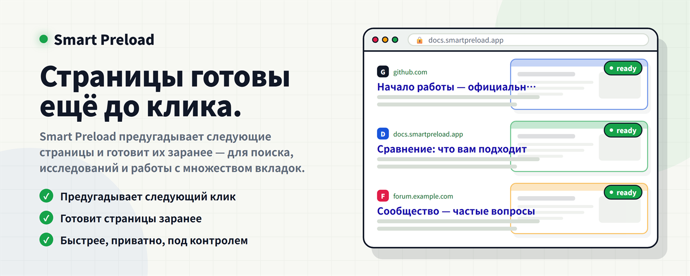
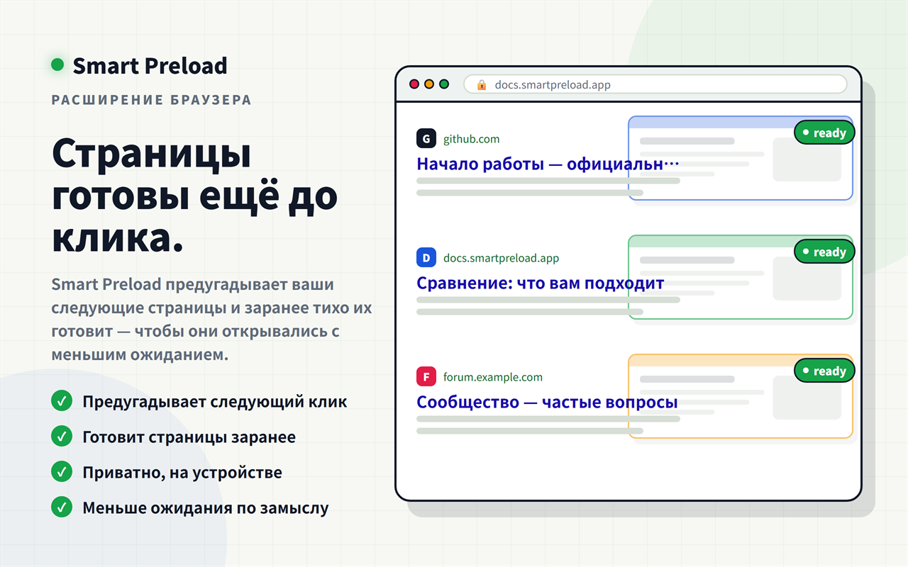
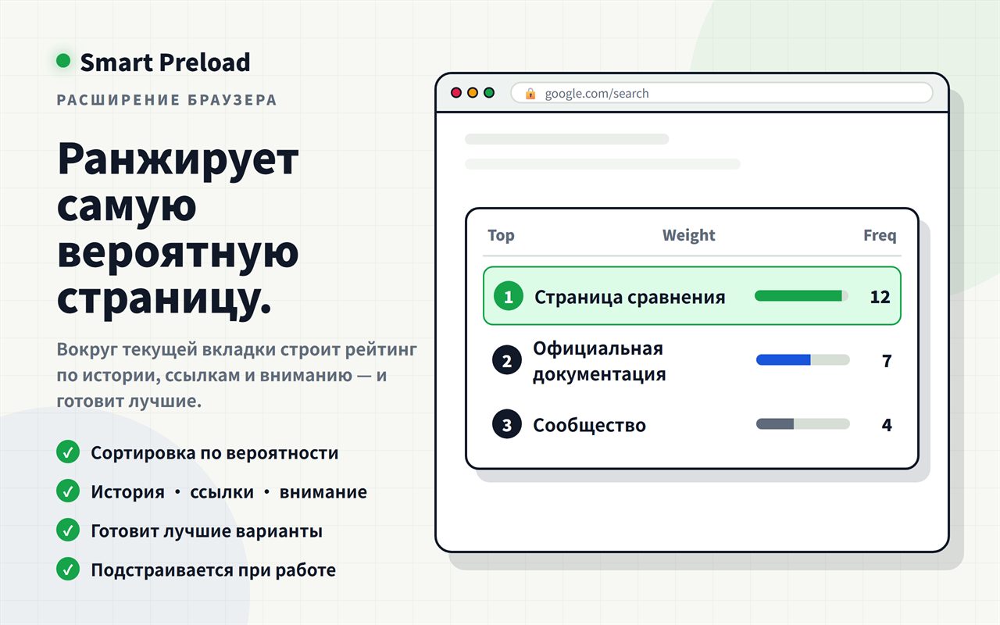
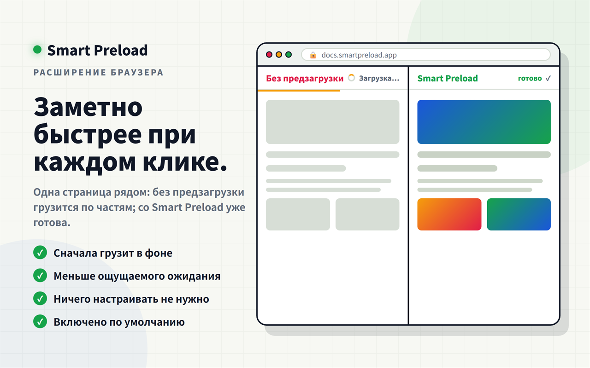
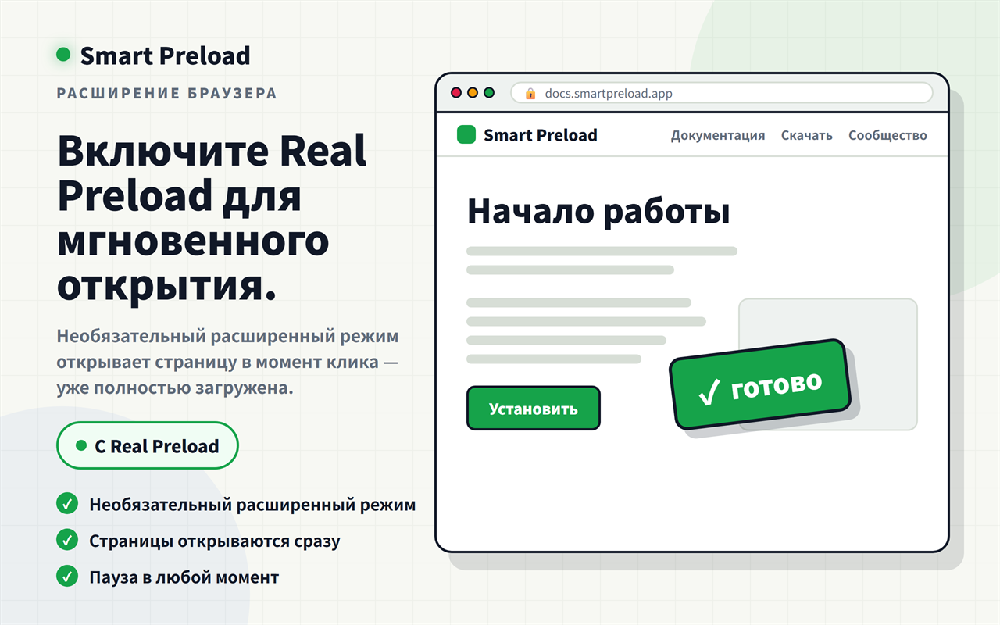
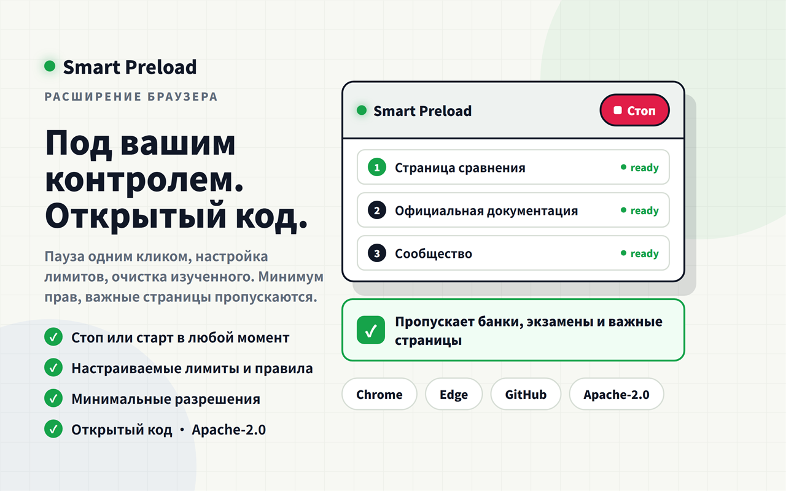

  

# Smart Preload / Zero Latency Web

[English](README.md) | [简体中文](README.zh-CN.md) | [繁體中文](README.zh-TW.md) | [日本語](README.ja.md) | [한국어](README.ko.md) | [Deutsch](README.de.md) | [Français](README.fr.md) | [Español](README.es.md) | [Português (Brasil)](README.pt-BR.md) | Русский

Smart Preload использует интеллектуальные алгоритмы предварительной загрузки, чтобы уменьшить воспринимаемое ожидание загрузки и улучшить опыт просмотра.

Он особенно полезен, когда вы просматриваете результаты поиска, сравниваете страницы или часто переходите между связанными сайтами.

## Основной способ установки

**Обычным пользователям лучше устанавливать Smart Preload из [Chrome Web Store](https://chromewebstore.google.com/detail/smart-preload/poikolgeopfpaoainnakkbjlbmloploc?utm_source=ext_app_menu).** Это рекомендуемый основной канал загрузки.

[GitHub Releases](https://github.com/BIOcanse/Smart-Preload/releases/latest) предназначены в основном для опционального Windows-приложения, заметок к релизам и пакетов для ручной установки.

## Что Означает Рейтинг

Рейтинг в popup относится к текущей вкладке. Это не общий список популярных страниц.

- `Top` показывает страницы, которые Smart Preload скорее всего подготовит для этой вкладки.
- `Weight` означает текущий приоритет.
- `Freq` показывает изученную частоту переходов с этой страницы или сайта.
- `prerender`, `prefetch` и `hidden-tab` показывают способ подготовки страницы.
- Статус показывает, готов кандидат, загружен или ожидает.

Этот список помогает понять, что расширение готовит сейчас, и проверить, почему ссылка была выбрана или не выбрана.

## Когда Нужно Поставить На Паузу

Остановите Smart Preload перед онлайн-экзаменами, сессиями с прокторингом, корпоративными заблокированными браузерами, банковскими операциями и страницами со строгой проверкой безопасности. Такие среды могут не принимать расширения, фоновые вкладки или заранее загруженные страницы.

Для быстрой паузы используйте кнопку `Stop` в popup. Также можно выключить `Enable preloading` в настройках. Если экзаменационный или защитный инструмент проверяет фоновые приложения, перед началом закройте Windows-приложение из трея.

## История И Перенос Данных

Изученная история хранится в хранилище расширения браузера, а не в папке Windows-приложения.

Обычные пути:

- Chrome: `%LOCALAPPDATA%\Google\Chrome\User Data\<Profile>\Local Extension Settings\<extension-id>\`
- Edge: `%LOCALAPPDATA%\Microsoft\Edge\User Data\<Profile>\Local Extension Settings\<extension-id>\`

`<Profile>` часто называется `Default` или `Profile 1`. ID расширения виден в деталях на `chrome://extensions` или `edge://extensions`.

Перенос на другой компьютер или профиль:

1. Один раз установите или загрузите расширение в целевом браузере.
2. Полностью закройте этот браузер.
3. Скопируйте содержимое старой папки `<extension-id>` в соответствующую папку хранилища расширения в целевом браузере.
4. Если ID расширения изменился, скопируйте содержимое в папку нового ID.
5. Снова запустите браузер.

Папка `portable` Windows-приложения хранит файлы привязки и логи, а не историю просмотра. В настройках можно удалить изученные записи по диапазону дат UTC.

## Установка

Для обычного использования установите расширение из [Chrome Web Store](https://chromewebstore.google.com/detail/smart-preload/poikolgeopfpaoainnakkbjlbmloploc?utm_source=ext_app_menu).

1. Установите расширение в Chrome или Edge.
2. Необязательно: скачайте и распакуйте Windows-приложение со страницы [GitHub Releases](https://github.com/BIOcanse/Smart-Preload/releases/latest).
3. Запустите `install-register.cmd` из папки app или один раз запустите приложение.
4. Оставьте папку app в ее окончательном расположении.

Расширение может работать без Windows-приложения. Приложение доступно только для Windows и нужно для более сильной локальной интеграции с браузером.

## Поддержка Браузеров

- Google Chrome
- Microsoft Edge
- Другие браузеры на базе Chromium могут работать, но основными целями являются Chrome и Edge.

## Лицензия

Smart Preload / Zero Latency Web распространяется по лицензии [Apache License 2.0](LICENSE). Уведомления об атрибуции см. в [NOTICE](NOTICE).

## Промоизображения Chrome Web Store

