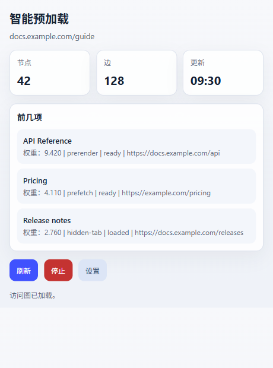
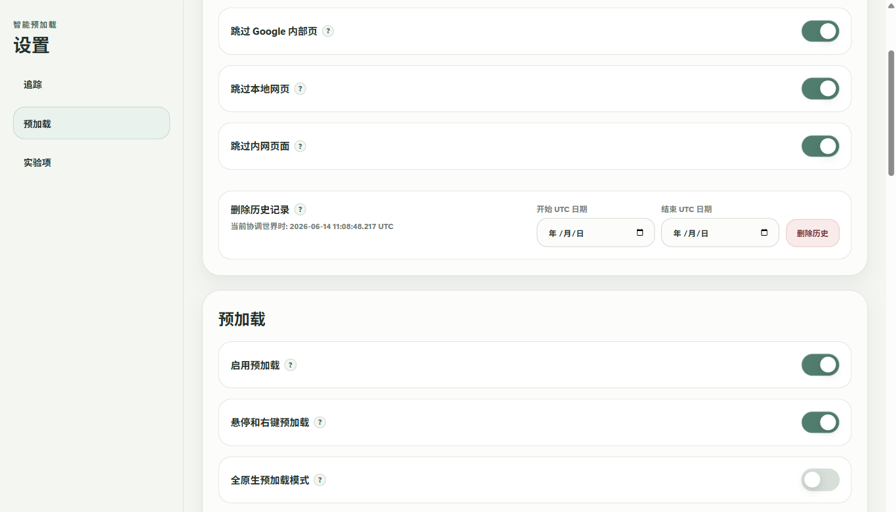

  

# 智能预加载 / Zero Latency Web

[English](README.md) | 简体中文 | [繁體中文](README.zh-TW.md) | [日本語](README.ja.md) | [한국어](README.ko.md) | [Deutsch](README.de.md) | [Français](README.fr.md) | [Español](README.es.md) | [Português (Brasil)](README.pt-BR.md) | [Русский](README.ru.md)

智能预加载会提前准备你很可能下一步打开的页面，让连续浏览、资料检索、页面对比和文档阅读少一点等待感。

它最适合多标签办公、查资料、看搜索结果、比价、查文档，以及经常在相关页面之间来回跳转的场景。

## 排行有什么用

插件弹窗里的排行只针对当前标签页，不是全局热门页面。

- `前几项` 是当前标签页最可能被提前准备的页面。
- `Weight` 是当前优先级。
- `Freq` 是从当前页面或当前站点跳过去的历史频次。
- `prerender`、`prefetch`、`hidden-tab` 表示页面准备方式。
- 状态会告诉你候选页面已经准备好、已经加载，还是仍在等待。

这个排行主要用来判断插件现在正在准备什么，也可以用来排查某个链接为什么没有被选中。

## 什么时候要暂停

在线考试、远程监考、公司受控浏览器、网银流程、强风控页面等场景，建议先暂停智能预加载。这些场景可能不接受扩展、后台标签页或提前加载页面。

临时暂停可以点弹窗里的 `停止`。也可以在设置里关闭 `启用预加载`。如果考试或安全工具还会检查后台程序，开始前也可以从托盘退出 Windows 配套 app。

## 历史数据和迁移方式

智能预加载的学习历史保存在浏览器扩展存储里，不在 Windows app 文件夹里。

常见路径：

- Chrome：`%LOCALAPPDATA%\Google\Chrome\User Data\<Profile>\Local Extension Settings\<extension-id>\`
- Edge：`%LOCALAPPDATA%\Microsoft\Edge\User Data\<Profile>\Local Extension Settings\<extension-id>\`

`<Profile>` 通常是 `Default` 或 `Profile 1`。扩展 ID 可以在 `chrome://extensions` 或 `edge://extensions` 的扩展详情里看到。

迁移到新电脑或新浏览器 profile：

1. 先在目标浏览器安装或加载一次扩展。
2. 完全关闭目标浏览器。
3. 把旧的 `<extension-id>` 文件夹内容复制到目标浏览器对应的扩展存储文件夹。
4. 如果扩展 ID 变了，把旧文件夹内容复制进新的扩展 ID 文件夹。
5. 重新启动浏览器。

Windows app 的 `portable` 文件夹保存的是 app 绑定文件和日志，不是浏览历史。设置页里也可以按 UTC 日期区间删除学习记录。

## 安装

请从 [GitHub Releases](https://github.com/kingstonwang114514-cloud/zero-latency-web/releases/latest) 下载最新版。

1. 先在 Chrome 或 Edge 中安装或加载扩展。
2. 可选：解压 Windows 配套 app。
3. 在 app 文件夹中运行 `install-register.cmd`，或者启动一次 app。
4. app 文件夹放好后不要随意移动。

扩展可以不依赖 Windows app 单独运行。Windows app 仅支持 Windows，主要用于更强的本地浏览器配合。

## 浏览器支持

- Google Chrome
- Microsoft Edge
- 其他 Chromium 浏览器可能可用，但主要适配目标是 Chrome 和 Edge。
