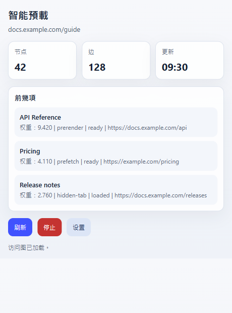
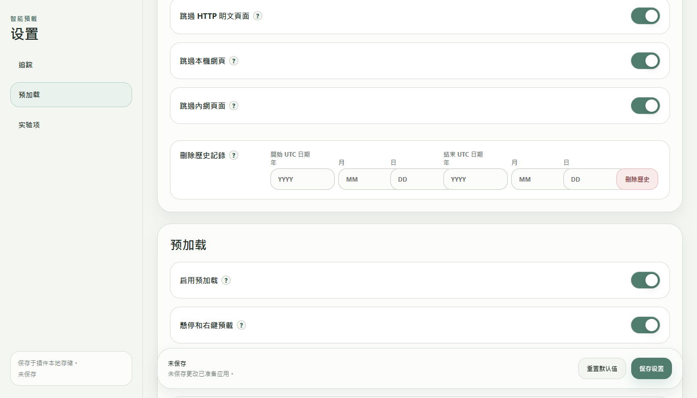

  

# 智慧預載 / Zero Latency Web

[English](README.md) | [简体中文](README.zh-CN.md) | 繁體中文 | [日本語](README.ja.md) | [한국어](README.ko.md) | [Deutsch](README.de.md) | [Français](README.fr.md) | [Español](README.es.md) | [Português (Brasil)](README.pt-BR.md) | [Русский](README.ru.md)

智慧預載使用智慧的預載演算法，降低使用者感受到的頁面載入等待時間，並提升整體瀏覽體驗。

它最適合多分頁工作、查資料、看搜尋結果、比價、查文件，以及經常在相關頁面之間切換的場景。

## 排行有什麼用

擴充功能彈窗裡的排行只針對目前分頁，不是全域熱門頁面。

- `前幾項` 是目前分頁最可能被提前準備的頁面。
- `Weight` 是目前優先級。
- `Freq` 是從目前頁面或目前站點跳過去的歷史頻次。
- `prerender`、`prefetch`、`hidden-tab` 表示頁面準備方式。
- 狀態會告訴你候選頁面已準備好、已載入，或仍在等待。

這個排行主要用來判斷擴充功能現在正在準備什麼，也可以用來排查某個連結為什麼沒有被選中。

## 什麼時候要暫停

線上考試、遠端監考、公司受控瀏覽器、網銀流程、強風控頁面等場景，建議先暫停智慧預載。這些場景可能不接受擴充功能、背景分頁或提前載入頁面。

臨時暫停可以點彈窗裡的 `停止`。也可以在設定裡關閉 `啟用預載`。如果考試或安全工具還會檢查背景程式，開始前也可以從系統匣退出 Windows 配套 app。

## 歷史資料和遷移方式

智慧預載的學習歷史保存在瀏覽器擴充功能儲存裡，不在 Windows app 資料夾裡。

常見路徑：

- Chrome：`%LOCALAPPDATA%\Google\Chrome\User Data\<Profile>\Local Extension Settings\<extension-id>\`
- Edge：`%LOCALAPPDATA%\Microsoft\Edge\User Data\<Profile>\Local Extension Settings\<extension-id>\`

`<Profile>` 通常是 `Default` 或 `Profile 1`。擴充功能 ID 可以在 `chrome://extensions` 或 `edge://extensions` 的擴充功能詳情裡看到。

遷移到新電腦或新瀏覽器 profile：

1. 先在目標瀏覽器安裝或載入一次擴充功能。
2. 完全關閉目標瀏覽器。
3. 把舊的 `<extension-id>` 資料夾內容複製到目標瀏覽器對應的擴充功能儲存資料夾。
4. 如果擴充功能 ID 變了，把舊資料夾內容複製進新的擴充功能 ID 資料夾。
5. 重新啟動瀏覽器。

Windows app 的 `portable` 資料夾保存的是 app 綁定檔案和日誌，不是瀏覽歷史。設定頁裡也可以按 UTC 日期區間刪除學習記錄。

## 安裝

請從 [GitHub Releases](https://github.com/kingstonwang114514-cloud/zero-latency-web/releases/latest) 下載最新版。

1. 先在 Chrome 或 Edge 中安裝或載入擴充功能。
2. 選用：解壓縮 Windows 配套 app。
3. 在 app 資料夾中執行 `install-register.cmd`，或啟動一次 app。
4. app 資料夾放好後不要隨意移動。

擴充功能可以不依賴 Windows app 單獨執行。Windows app 僅支援 Windows，主要用於更強的本機瀏覽器配合。

## 瀏覽器支援

- Google Chrome
- Microsoft Edge
- 其他 Chromium 瀏覽器可能可用，但主要適配目標是 Chrome 和 Edge。
